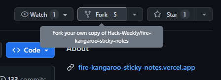
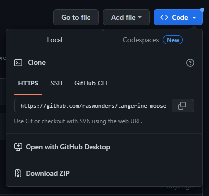
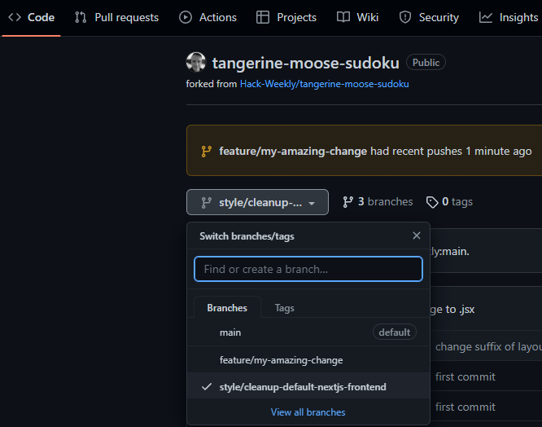
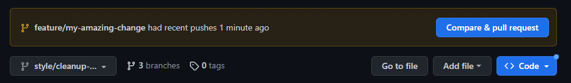

This is a [Next.js](https://nextjs.org/) project bootstrapped with [`create-next-app`](https://github.com/vercel/next.js/tree/canary/packages/create-next-app).

## Getting Started

First, run the development server:

```bash
npm run dev
# or
yarn dev
# or
pnpm dev
```

Open [http://localhost:3000](http://localhost:3000) with your browser to see the result.

You can start editing the page by modifying `app/page.js`. The page auto-updates as you edit the file.

This project uses [`next/font`](https://nextjs.org/docs/basic-features/font-optimization) to automatically optimize and load Inter, a custom Google Font.

## Learn More

To learn more about Next.js, take a look at the following resources:

- [Next.js Documentation](https://nextjs.org/docs) - learn about Next.js features and API.
- [Learn Next.js](https://nextjs.org/learn) - an interactive Next.js tutorial.

You can check out [the Next.js GitHub repository](https://github.com/vercel/next.js/) - your feedback and contributions are welcome!

## Deploy on Vercel

The easiest way to deploy your Next.js app is to use the [Vercel Platform](https://vercel.com/new?utm_medium=default-template&filter=next.js&utm_source=create-next-app&utm_campaign=create-next-app-readme) from the creators of Next.js.

Check out our [Next.js deployment documentation](https://nextjs.org/docs/deployment) for more details.

## How to contribute

### Create account on [github.com](https://github.com)

### Fork [Hack-Weekly's repository](https://github.com/Hack-Weekly/fire-kangaroo-sticky-notes)


### Clone this forked repo to your local machine
```bash
git clone your-forked-repo-url
```



### Check if Hack-Weekly repo upstream branch is present
```bash
git remote -v

# If remote upstream doesn't exist create it 
git remote add upstream https://github.com/Hack-Weekly/fire-kangaroo-sticky-notes
``` 

### Create unique branch for each change
```bash
git checkout -b your-feature-branch

# keep commiting to newly create branch 
git add .
git commit -m "Your commit message"
...
```

### Before you share your-feature-branch, rebase it with upstream changes
```bash
git fetch upstream
git checkout your-feature-branch
git rebase upstream/main

# in case of conflicts, solve them and continue
git rebase --continue

# share your-feature-branch by pushing it to your fork on github
git push origin your-feature-branch --force
```

### Create Pull Request (on github.com) for your-feature-branch against upstream
- Navigate to your forked repository
- In Code tab switch active branch to your-feature-branch you just pushed

- Click on Create & Compare button to create Pull Request 

- Fill in the details about changes you performed and if possible link your trello task to it.
 
### After Pull Request was created
- Keep your-feature-branch intact until the PR is approved and merged
- While Pull Reuqest is still pending, be careful about creating additional PRs for same files, otherwise there will be merge conflicts

### After Pull Request was merged into upstream
- Update your local main branch with upstream changes
```bash
git fetch upstream
git checkout main
git rebase upstream/main

# in case of conflicts, solve them and continue
git rebase --continue

# Share these also to your main on github repo
git push origin main --force
```
